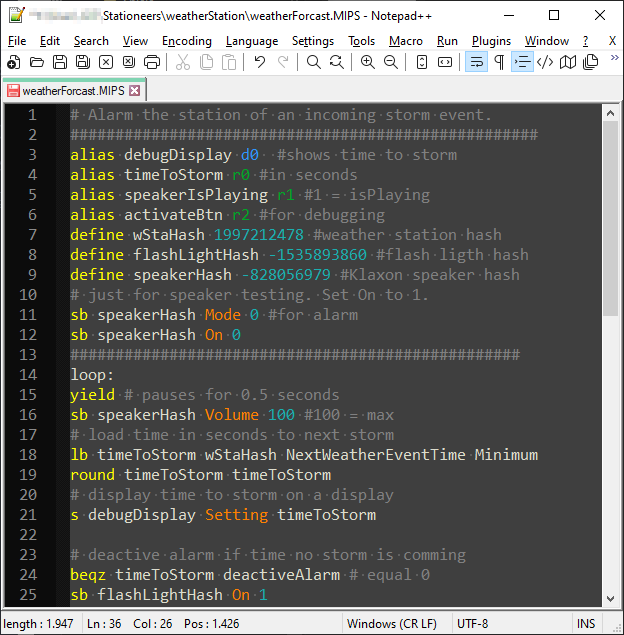

# Description

User defined language for notepad++ allowing syntax highlighting for integrated chips programs.

# Sample

# Installation

* Download the `ic_udl.xml` file.
* In the "Language" menu, select "Define your language...", then click the "Import..." button.
* Select the `ic_udl.xml` file on your disk.
* Done, enjoy.
* (you can now remove the `ic_udl.xml` file if you like)

# Contributions

Pull requests are welcome.

All contributors are expected to follow the [contributor covenant](https://www.contributor-covenant.org/version/1/4/code-of-conduct) Code of Conduct.
